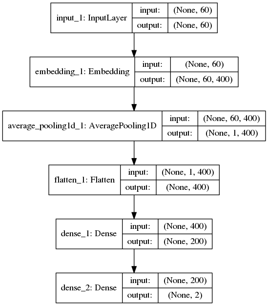
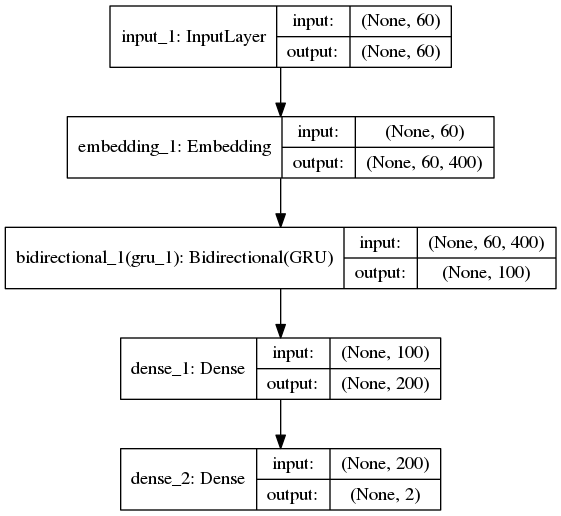
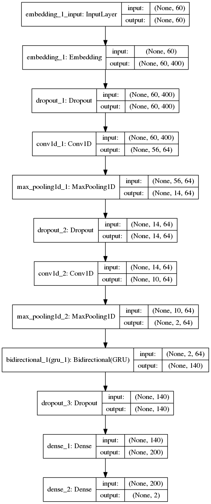
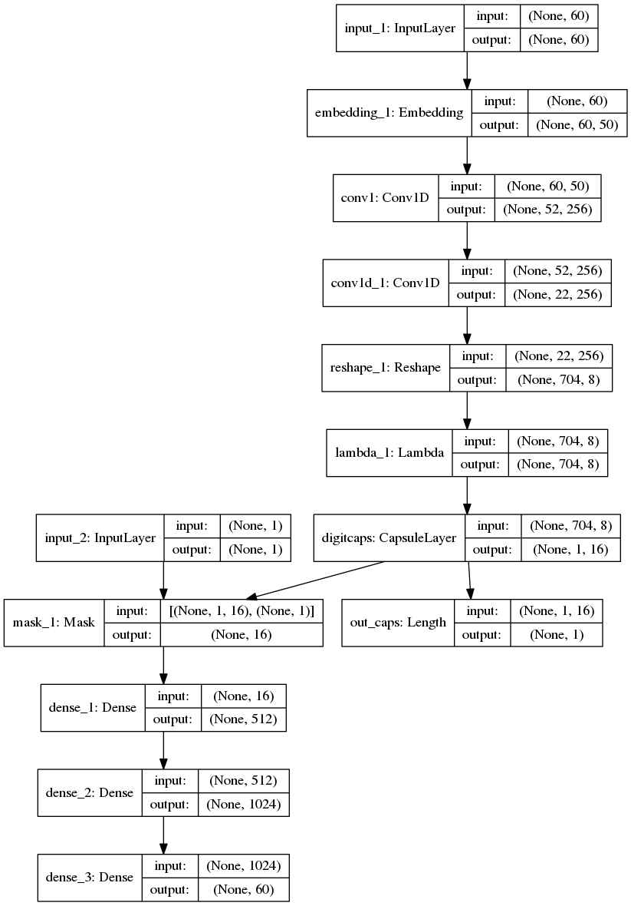

# vardial2018_dfs
Discriminating between Dutch and Flemish in Subtitles is one task in [VarDial2018](http://alt.qcri.org/vardial2018/)


# Systems trained during evaluation 

## Dual-CNN


```
Train CV F1: 0.62
Dev F1: 0.61
```
## Bag-of-Ngram
```
Train CV F1: 0.63
Dev F1: 0.69
```
# Post evaluation system
## MLP

```
Test F1: 0.6334
```
## AVERAGE

```
Test F1: 0.6402
```
## BGRU

```
Test F1: 0.6413
```
## CNN-LSTM

```
Test F1: 0.6399
```
## Capusle Network

```
Test F1: 0.6206
```
## FastText
```
Test F1:0.6457
```
## Models that not work
### gensim.doc2vec
```
0.53
```
# Single models only, on ensemble of multiple systems.
