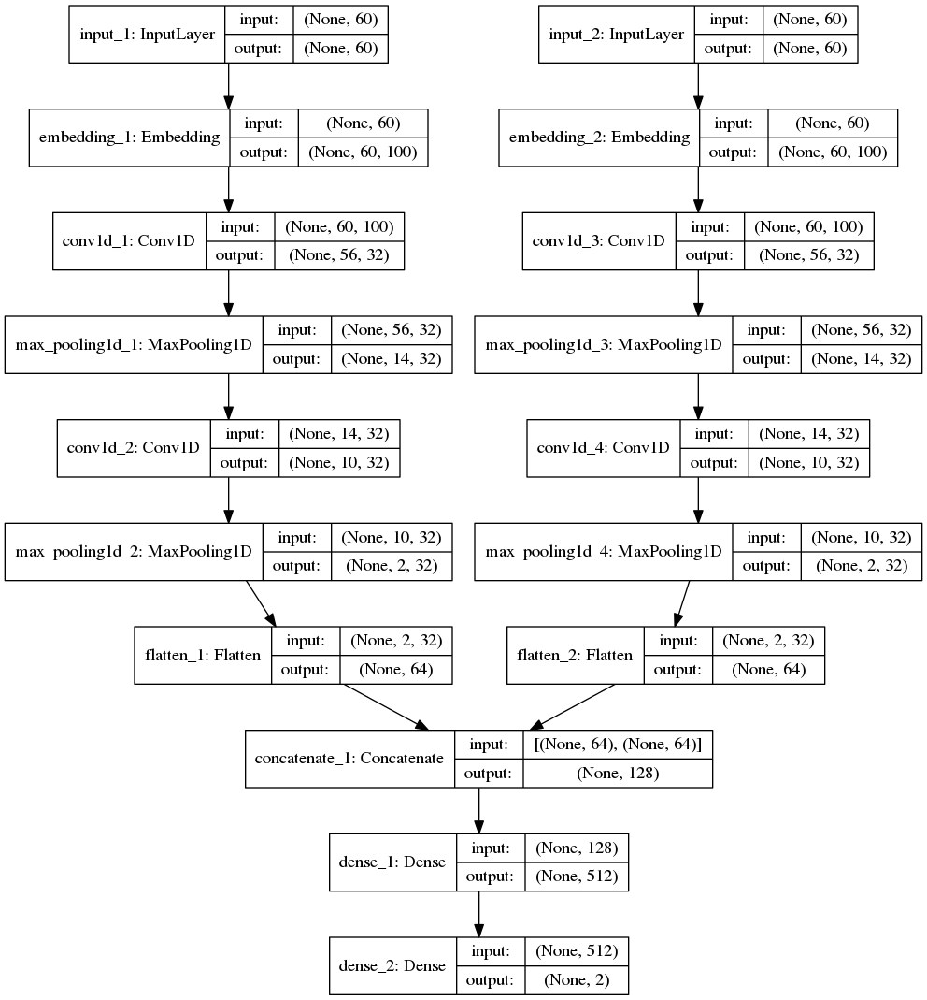
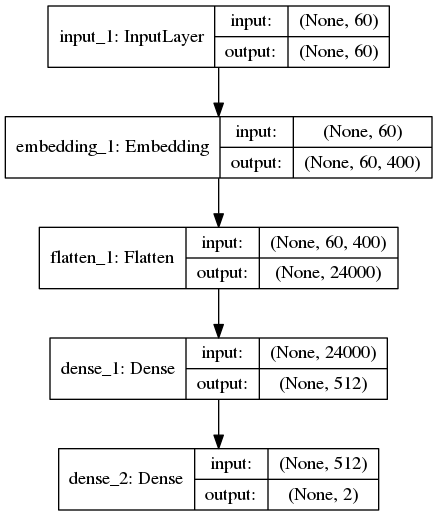
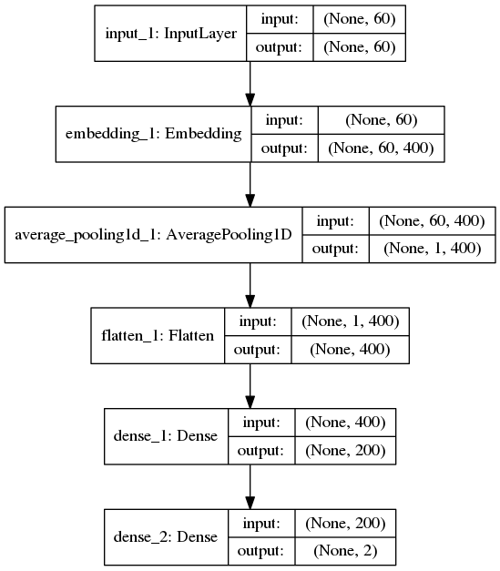
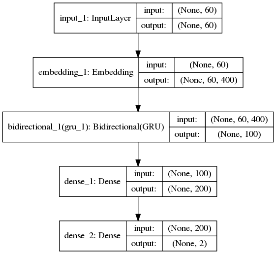
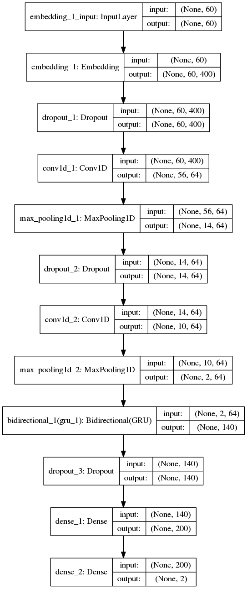
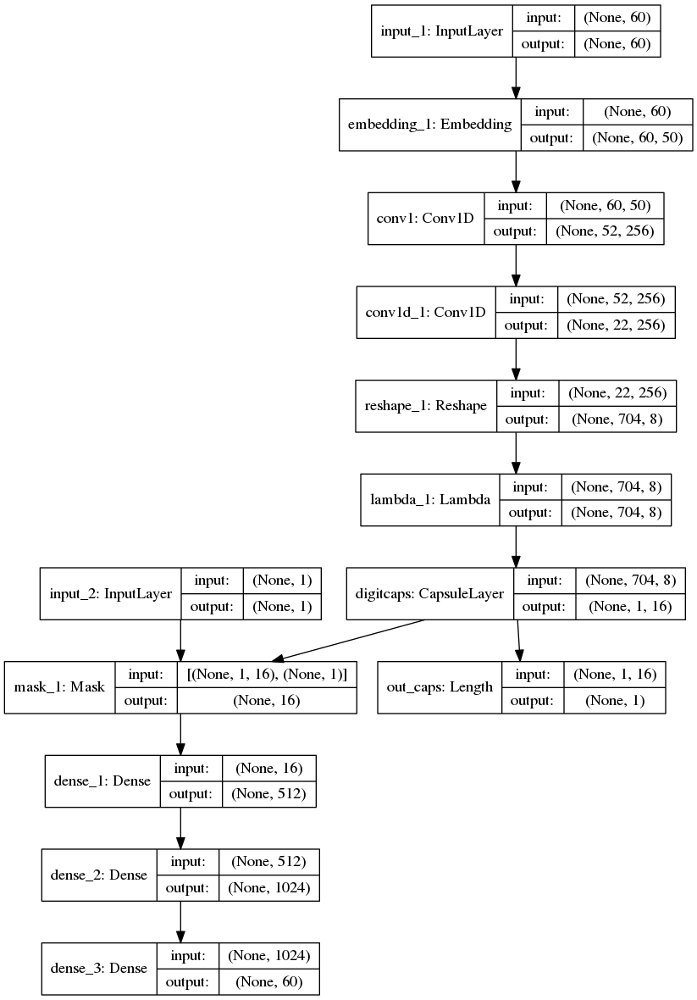

# System for VarDial2018 DFS
Discriminating between Dutch and Flemish in Subtitles(DFS) is one task in [VarDial2018](http://alt.qcri.org/vardial2018/).
Dutch is the language spoken in Netherlands and Flemish is a variant of Dutch language and known as Belgian Dutch.
This task is a supervised learning task, there are 300000 labeled training samples 500 labeled development samples and 20000 test samples.
Each sample is a sentence in text form. The average sentence length in character, average number of words per sentence, the count of unique words and the count of shared words are listed in the following table.

| Dialect | DUT | BEL |
| --- | --- | --- |
| Number of samples | 150000 | 150000 |
| Average number of characters per sentence | 187.86 | 187.90 |
| Average number of words per sentence | 40.36 | 40.35 |
| Unique words | 115560 | 115442 |
| Shared words | 66142 |
| Percentage of shared words | 57.2% | 57.2%|

This study treats the dialect discrimination task as a text classification problem.
In the following session various system will be introduced to tackle this problem.

# Systems trained during evaluation 
During evaluation, two systems were proposed: a bag-of-Ngram based system and a deep learning based Dual-CNN system.
## Bag-of-Ngram
n this work the bag-of-Ngram system and Linear SVM is used as baseline system. First the text is lower-cased and converted to n-gram tokens (n is from 1 to 3), then filtered by TF-IDF with minimal document frequency of 5. Extracted features are used to train Linear SVM classifier. A 20 folds cross validation is performed, the average F1 score is 0.63 and 0.69 is obtained on development set.
```
Score for Bag-of-Ngram:
Train CV F1: 0.63
Dev F1: 0.69
```

## Dual-CNN
Another system used during evaluation is a Dual-CNN system. There are two CNNs in the this system,
one is build on DUT word embedding and one is build on BEL word embedding,the outputs of these two CNN are concatenated and linked to a full connected layer. * If not specified, all embedding in the paper are word level embedding. * The motivation of having a Dual-CNN is that, given a text input ,we hope each CNN could capture language specific features.
Following diagram shows the architectural of Dual-CNN system.


```
Score for Dual-CNN:
Train CV F1: 0.62
Dev F1: 0.61
```
# Post evaluation system

## MLP

```
Test F1: 0.6334
```
## AVERAGE

```
Test F1: 0.6402
```
## BGRU

```
Test F1: 0.6413
```
## CNN-LSTM

```
Test F1: 0.6399
```
## Capusle Network

```
Test F1: 0.6206
```
## FastText
```
Test F1:0.6457
```
## Models that not work
### gensim.doc2vec
```
0.53
```

